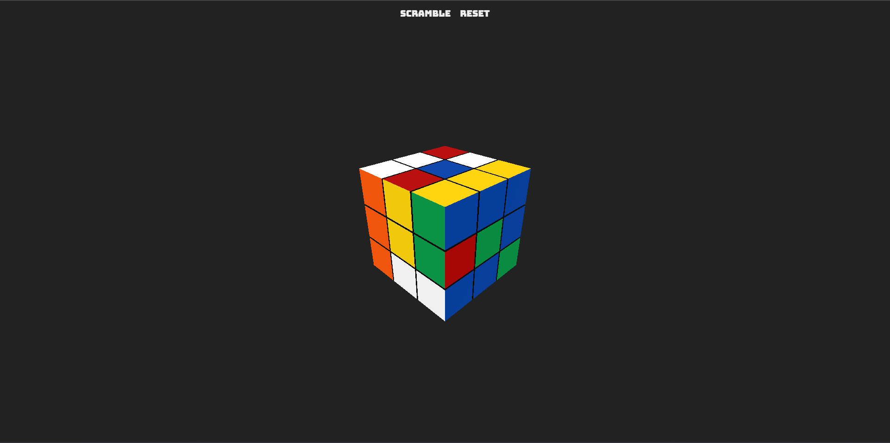

<h1  align="center">
  <sub>
    </img>
  </sub>
  Rubik's Cube
</h1>

<p align="center">WebGL Rubik's Cube built with <a href="https://github.com/mrdoob/three.js/">THREE.js</a></p>

<span>
  </img>
</span>

## Description

A WebGL Rubik's Cube built with [THREE.js](https://github.com/mrdoob/three.js/). Click and drag to move the cube around and to rotate.
<br>

Built as a learning exercise in THREE.js

## Run locally
- Download the project
- Run ```npm install```
- Project is built with [VITE](https://github.com/vitejs/vite) so run ```npm run dev``` to start a local server and ```npm run build``` for building 


